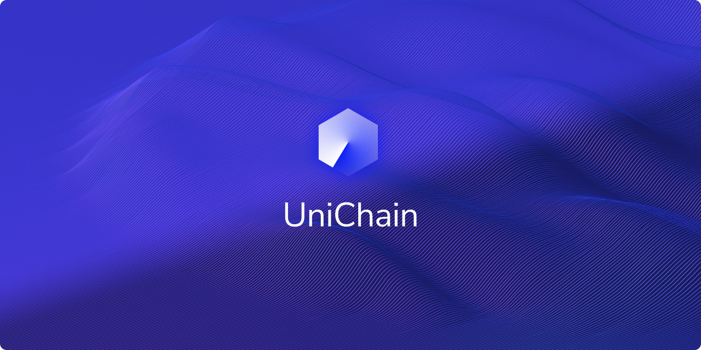

# UniChain

UniChain is a single global monoauth management application with the power of blockchain to make this process simpler and faster for humans worldwide, significantly reducing the requirement for paper documents and countless ID cards that an individual has to carry. There a UniChain ID to identify anyone on the network. Unichain would help any indivisual verify, request and get any documents of a person using a single click, safe and secure, with permission and analytics of usage
UniChain is a global monoauth management application with the power of blockchain to make this process simpler and faster for humans worldwide, significantly reducing the requirement for paper documents and countless ID cards that an individual has to carry. There a UniChain ID to identify anyone on the network.

Unichain would help any individual verify, request, and get any documents of a person using a single click, safe and secure, with permission and analytics of usage of private data giving full control of their privacy right into their arms. The user will get notified when any of their items are used by anybody (such as banks, organizations, and entities, etc.) so that they get to know what actually happens with their paperwork.

TL;DR: Unique way of Securing Data Privacy using Blockchain 
Tech

Our designs can be accessed [here](https://www.figma.com/file/DaFcpkzfTLux6R8n0sDIIB/UniChain?node-id=2%3A1)

## TechStack

- React
- [Figma](https://www.figma.com/file/DaFcpkzfTLux6R8n0sDIIB/UniChain?node-id=2%3A1)
- Ethereum
- Smart Contract (In Research Phase)